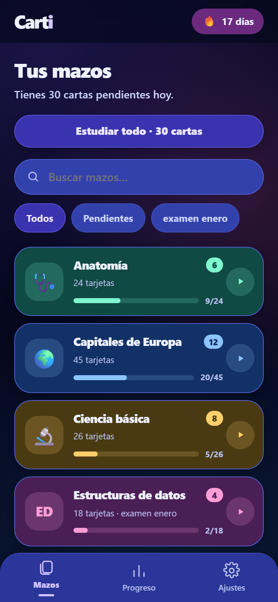
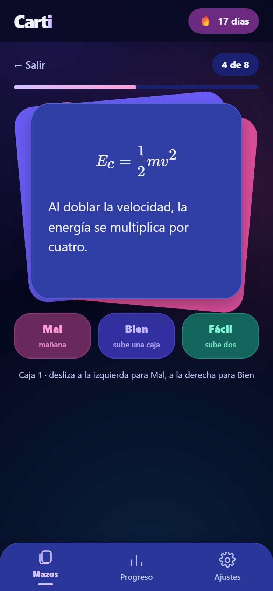
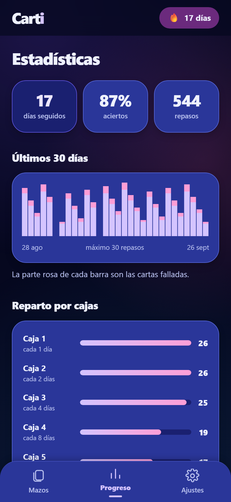

<div align="center">


# Carti

**Tarjetas de pregunta y respuesta que se acuerdan por ti de cuándo toca repasar.**

Se instala en el móvil, funciona sin conexión y todo se queda en tu teléfono:
sin cuenta, sin servidor y sin que nada salga de ahí.

### [Abrir Carti →](https://cristianinbits.github.io/flashcards/)

</div>

| Tus mazos | Estudiando | Tu progreso |
| :--: | :--: | :--: |
|  |  |  |

<div align="center"><sub>Capturas con datos de ejemplo.</sub></div>

## Cómo se usa

**1. Haz un mazo.** Un mazo es un tema: *Anatomía*, *Capitales de Europa*, *Alemán A2*.
Le pones nombre, un icono si quieres, y ya puedes meterle cartas.

**2. Mete las cartas.** Una carta es una pregunta por delante y su respuesta por detrás. La
respuesta admite negritas, listas, fórmulas y fotos, así que no tienes que resumirlo todo en
una línea.

Si ya tienes los apuntes escritos, **no los copies a mano**: pégalos en *Importar* y salen las
cartas solas. Hay [cuatro mazos de ejemplo](ejemplos/) para probarlo en un minuto.

**3. Estudia.** Sale la pregunta, la piensas, tocas la carta para darle la vuelta y dices qué tal
ha ido: **Mal**, **Bien** o **Fácil**. También vale deslizar la carta a izquierda o derecha.

**4. Vuelve mañana.** Carti te pone delante solo las que tocan ese día. Cuando no quede ninguna,
te lo dice y se acabó: no hay forma de estudiar de más.

## Por qué no toca repasarlo todo cada día

Cada carta vive en una de cinco cajas. Si te la sabes sube una caja y tarda más en volver; si
fallas baja a la primera y la ves al día siguiente. Lo que ya te sabes te deja en paz, y lo que
se te resiste aparece una y otra vez.

| Caja | Vuelve a salir |
| :-- | :-- |
| 1 | al día siguiente |
| 2 | a los 2 días |
| 3 | a los 4 días |
| 4 | a los 8 días |
| 5 | a los 16 días |

¿Y si quieres darle un repaso rápido a un mazo entero antes de un examen? Para eso está la
**práctica libre**: entran todas las cartas, no cuenta para las estadísticas y no cambia cuándo
toca repasar de verdad.

## Instalarlo en el móvil

Abre [la página](https://cristianinbits.github.io/flashcards/) en el teléfono y:

- **Android (Chrome):** acepta el aviso de instalación, o menú **⋮** → *Instalar aplicación*.
- **iPhone (Safari, tiene que ser Safari):** botón de compartir → *Añadir a pantalla de inicio*.

Queda como una aplicación más, con su icono, a pantalla completa y sin barra del navegador.
Después de la primera visita funciona en avión, en el metro y sin cobertura.

## Tus cartas son tuyas

No hay cuenta ni servidor: **todo se guarda dentro del navegador de tu teléfono**. Nadie más lo
ve, ni yo.

Eso tiene una contrapartida, y conviene saberla: si borras los datos del navegador o desinstalas
la aplicación, tus mazos se van con ellos. En **Ajustes** tienes *Copia de seguridad*, que baja
un fichero con todo; guárdalo de vez en cuando y podrás restaurarlo aquí o en otro teléfono.

En Ajustes están también el tema claro y oscuro —por defecto sigue al del sistema— y el botón de
borrarlo todo.

---

## Para desarrollar

```bash
npm install
npm run dev
```

| Comando | Qué hace |
| --- | --- |
| `npm run dev` | Servidor de desarrollo en http://localhost:5173/flashcards/ |
| `npm run build` | Compila TypeScript y genera `dist/` con el service worker |
| `npm run preview` | Sirve `dist/` para probar la PWA real (el service worker no se registra en `dev`) |
| `npm test` | Tests con Vitest |
| `npm run lint` | ESLint |
| `npm run icons` | Regenera los iconos desde `assets/icon-source.png` |
| `npm run capturas` | Rehace las capturas del README, con `npm run dev` en marcha |

```
src/
  app/        entrada y rutas
  domain/     lógica pura: Leitner y sesión de estudio
  data/       Dexie, repositorios, importadores
  features/   una carpeta por pantalla
  ui/         componentes compartidos y tokens de tema
  lib/        utilidades (fechas, markdown, iconos)
ejemplos/     mazos de muestra listos para importar
```

`domain/` y `data/` no importan React: son la parte que sobrevive a un cambio de interfaz.

Cada push a `main` dispara [el workflow](.github/workflows/deploy.yml), que pasa lint, tests y
build y publica en GitHub Pages. La ruta base (`/flashcards/`) está en
[vite.config.ts](vite.config.ts).

- [Plan y alcance](docs/PLAN.md) — decisiones, modelo de datos, algoritmo y hoja de ruta.
- [Icono](docs/ICONO.md) — prompt de generación y requisitos de cada tamaño.

Funciona todo menos la generación de cartas con IA, que es lo que queda por hacer.
